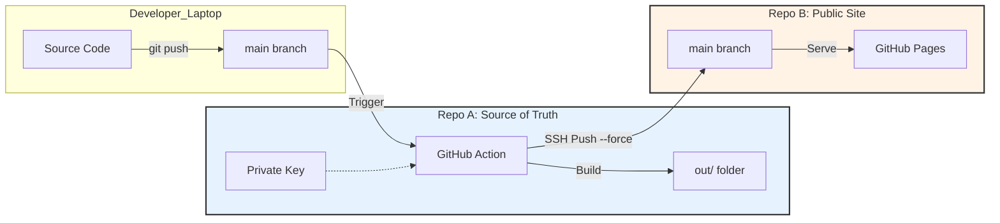

# Deployment Architecture

> [!IMPORTANT]
> **STRICT SEPARATION OF CONCERNS**
> This system is designed with a "One-Way Value Flow" philosophy. Code moves from source to deployment. It never moves back.

## Mental Model: The Factory and the Showroom

Imagine a car factory (Source Repo) and a car showroom (Deployment Repo).

*   **Repository A (Source)** is the **Factory**.
    *   This is where engineers work, weld, paint, and assemble.
    *   It is messy, contains blueprints (source code), tools (compilers), and raw materials (dependencies).
    *   **Rule**: Customers (Public Internet) are NEVER allowed in the factory.

*   **Repository B (Deployment)** is the **Showroom**.
    *   This contains ONLY the finished product (static HTML/CSS/JS).
    *   It is pristine, clean, and write-protected from the public.
    *   **Rule**: Engineers NEVER work directly in the showroom. You don't weld a car on the showroom floor.

*   **The Bridge (CI/CD)** is the **Transporter Truck**.
    *   It takes finished cars from the Factory to the Showroom.
    *   It is the ONLY thing allowed to put cars in the Showroom.

## 1. Architecture Overview

## 2. Guardrails & Rules

### ✅ DO
*   **DO** all work in `neeraj-senior-engineer-portfolio`.
*   **DO** use Pull Requests to merge into `main`.
*   **DO** trust the automated pipeline to handle deployment.
*   **DO** treat the Deployment Repo as "read-only" for humans.

### ❌ DO NOT
*   **DO NOT** clone the Deployment Repo locally.
*   **DO NOT** push directly to the Deployment Repo.
*   **DO NOT** add `node_modules` or build artifacts to the Source Repo.
*   **DO NOT** bidirectional sync. If the Deployment Repo gets messed up, the pipeline will fix it on the next run (Self-Healing).

## 3. Security Model

We use **SSH Deploy Keys** for the highest security isolation.

1.  **Deployment Repository (Target)**: Holds the **Public Key**.
    *   configured with `Write` access.
    *   "This lock accepts keys from the automated transporter."
2.  **Source Repository (Source)**: Holds the **Private Key**.
    *   Stored in GitHub Secrets as `DEPLOY_PRIVATE_KEY`.
    *   "Only this specific workflow holds the key to the showroom."

## 4. Validation Steps

To confirm the bridge is working:

1.  **Check Source**: ensuring `git status` is clean and you are on `main`.
2.  **Push**: `git push origin main`.
3.  **Observe**: Go to Source Repo > Actions. Watch the "Deploy to Production" workflow.
4.  **Verify**:
    *   Wait for success (green check).
    *   Go to Deployment Repo. Check the commit history. It should say "Deploy from [commit-hash]".
    *   Visit the live URL.

## 5. Troubleshooting & Failure Modes

| Symptom | Probable Cause | Fix |
| :--- | :--- | :--- |
| **Permission Denied (publickey)** | SSH Keys are mismatched or missing. | Regenerate SSH key pair. Update Public Key in Target Repo (Deploy Keys) and Private Key in Source Repo (Secrets). |
| **Workflow succeeds, but changes not visible** | Browser caching or GitHub Pages delay. | Hard refresh (Cmd+Shift+R). Check "pages build" status in Target Repo. |
| **"Updates were rejected" (git push error)** | Target repo has diverted history. | The pipeline uses `force push`. This shouldn't happen unless someone manually pushed to Target. The pipeline will overwrite manual changes automatically. |

## 6. Disaster Recovery

If the Deployment Repo is corrupted or deleted:
1.  Re-create the repository (if deleted).
2.  Re-add the SSH Deploy Key (Public).
3.  Go to Source Repo > Actions.
4.  Re-run the last successful workflow.
5.  **Result**: The site is fully restored. The Source Repo "hydrates" the Deployment Repo from scratch.
